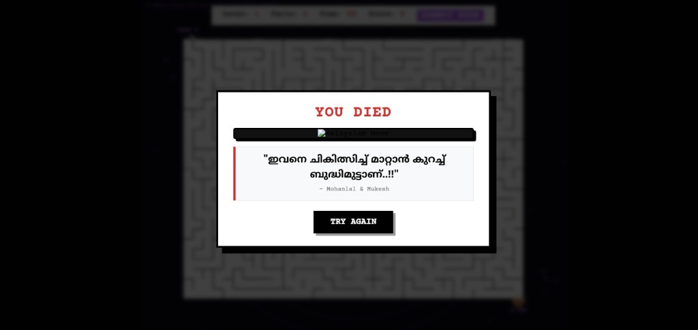
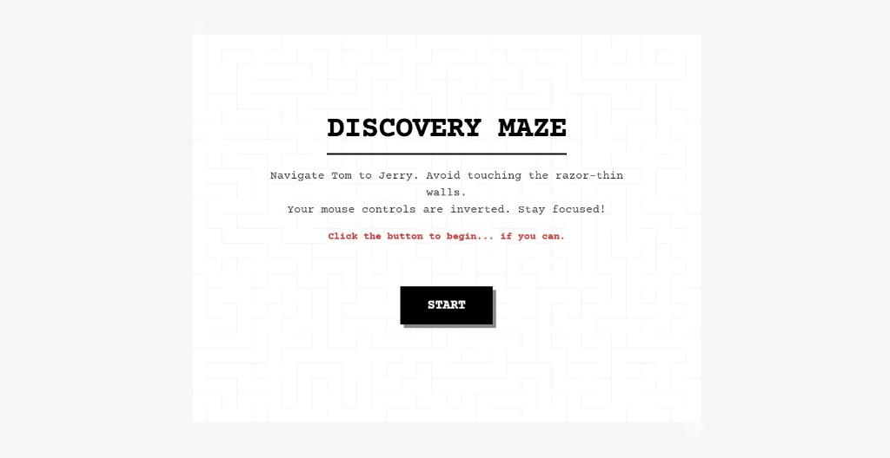

# Impossible Troll Maze 🎯

## Basic Details
* **Team Name:** REVENANT

### Team Members
* **Team Lead:** NIVEDHKRISHNA T R - CUSAT
* **Member 2:** NAFIL P K - CUSAT

## Project Description
A procedurally generated, infinitely looping, and intentionally impossible 2D maze game designed solely to induce maximum anxiety and troll the player with unfair mechanics, inverted controls, and fake-out systems. 

## The Problem (that doesn't exist)
Gamers have gotten too comfortable. They expect fair mechanics, clear winning conditions, and responsive controls. The world was suffering from a severe lack of unadulterated frustration and pure, unfiltered rage-quitting.

## The Solution (that nobody asked for)
We built a maze game where the mouse input is perfectly inverted, the collision boundaries are microscopic yet unforgiving, the timer is an anxiety-inducing loop that never ends, and the only possible "winning" condition actually triggers a fake Blue Screen of Death. It's a masterclass in psychological torment.

## Technical Details

### Technologies/Components Used
#### For Software:
* **Languages used:** HTML5, CSS3, JavaScript
* **Frameworks used:** Vanilla JS (HTML5 Canvas API)
* **Libraries used:** Web Audio API (Native browser audio synthesis)
* **Tools used:** Git, GitHub

#### For Hardware:
* N/A - This is a purely software-based web application.

## Implementation
#### For Software:

**Installation**
```bash
git clone https://github.com/nivedh-ktr/useless_project_temp.git
cd useless_project_temp
```

**Run**
```bash
# Simply open the index.html file in any modern web browser.
# Example for Windows:
start index.html
```

## Project Documentation
### For Software:

**Screenshots**

 
*The welcoming Start Screen masking the impending doom.*

 
*Navigating the impossibly thin walls with an inverted cursor.*

 
*The failure modal displaying a Malayalam quote upon crashing into a wall.*

**Diagrams**

```mermaid
graph TD
    Start([Player Clicks Start]) --> Init[Initialize Game State]
    Init --> MazeGen[Procedural Maze Generation]
    
    subgraph Maze Generation Algorithm
        MazeGen --> DFS[Randomized DFS Path Carving]
        DFS --> Trap[Identify & Seal Solution Path Midpoint]
        Trap --> BFS[BFS Component Labeling]
        BFS --> Loops[Carve Endless Loops & Dead Ends]
        Loops --> Gates[Open Multiple Decoy Entrances]
    end
    
    Gates --> GameLoop
    
    subgraph Physics & Render Loop (60 FPS)
        GameLoop((requestAnimationFrame))
        
        GameLoop --> Timer[Update 60s Anxiety Timer]
        Timer --> Audio[Synthesize Audio Ticks & Alarms]
        
        GameLoop --> Input[Process Inverted Mouse Input]
        Input --> Collision{Micro-Hitbox Collision}
        
        Collision -- "Near Wall (< 3px)" --> Buzz[Trigger Proximity CSS Buzz & Oscillator Hum]
        Collision -- "Clear" --> Move[Increment Score & Update Position]
        Collision -- "Hit Wall" --> Fail[Fail State]
        
        Move --> WinCheck{Win Condition}
        WinCheck -- "Reached Target via Secret Margin" --> BSOD[Trigger Fake BSOD System Crash]
    end
    
    Fail --> Shake[Trigger Screen Shake & Thud]
    Shake --> Modal[Display Malayalam Meme Modal]
    Modal -. "Click Try Again" .-> Init
```
*Architecture diagram showing the procedural DFS grid generation and component labeling trap.*

### For Hardware:
* N/A

## Project Demo
### Video
[Add your demo video link here] 
*This video demonstrates the inverted controls, the proximity vibration effects, the infinite timer loops, and the ultimate BSOD trap.*

### Additional Demos
* [Live Web Demo Link (If deployed) - TBD]

## Team Contributions
* **NIVEDHKRISHNA T R:** Core procedural maze generation algorithm, inverted mouse physics engine, and fake BSOD state trap implementation.
* **NAFIL P K:** UI/HUD integration, Web Audio synthesis logic, proximity vibration effects, and Malayalam meme translation.
